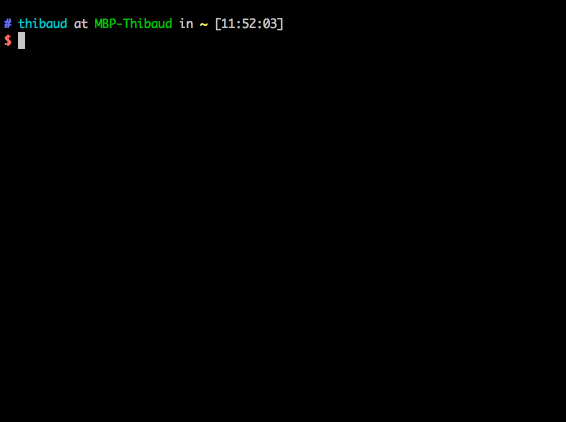

```
      ██            ██     ████ ██  ██
     ░██           ░██    ░██░ ░░  ░██
     ░██  ██████  ██████ ██████ ██ ░██  █████   ██████
  ██████ ██░░░░██░░░██░ ░░░██░ ░██ ░██ ██░░░██ ██░░░░
 ██░░░██░██   ░██  ░██    ░██  ░██ ░██░███████░░█████
░██  ░██░██   ░██  ░██    ░██  ░██ ░██░██░░░░  ░░░░░██
░░██████░░██████   ░░██   ░██  ░██ ███░░██████ ██████

  ▓▓▓▓▓▓▓▓▓▓▓▓▓▓▓▓▓▓▓▓▓▓▓▓▓▓▓▓▓▓▓▓▓▓▓▓▓▓▓▓▓▓▓▓▓▓▓▓▓▓▓▓▓▓▓▓▓▓▓▓▓▓▓▓▓▓▓▓▓▓▓▓▓▓▓
 ░▓ Software Installation, Configuration and Preferences for Springload     ▓
 ░▓ https://github.com/springload/dotfiles                                  ▓
 ░▓▓▓▓▓▓▓▓▓▓▓▓▓▓▓▓▓▓▓▓▓▓▓▓▓▓▓▓▓▓▓▓▓▓▓▓▓▓▓▓▓▓▓▓▓▓▓▓▓▓▓▓▓▓▓▓▓▓▓▓▓▓▓▓▓▓▓▓▓▓▓▓▓▓▓
```

[](http://www.springload.co.nz/) [](https://travis-ci.org/springload/dotfiles)

## Setting up your new Mac `(◕‿◕)`

>The goal is to automate __80%__ of the setup of your new computer.

1. Download a [ZIP of this repository](https://github.com/springload/dotfiles/archive/master.zip).
2. Unzip the file if necessary. You should have a `dotfiles-master` folder in your `Downloads` folder.
3. Launch the Terminal app, found in `/Applications/Utilities/`
4. Copy and paste the following line into the Terminal, and press `Enter`:

```bash
cd ~/Downloads/dotfiles-master && ./install.sh
```

The installation process should start, and ask you questions. You'll also be asked to enter your password from time to time. __If this is your first run on a fresh Mac, you'll have to start it again after the first install.__



This will automatically install a bunch of apps for you. You will get to choose what you want to install, and what you do not want.

When it's done, you can:

- Delete the `dotfiles-master` folder and forget about this.
- Head over to http://caskroom.io to look for apps that might interest you, and install them with `brew cask install <name of cask>`.
- Get back to your job!

### Going further

|:book:|
|-----------------------------------------|
|[Command-line tools](#command-line-tools)|
|[Fonts](#fonts)|
|[OSX Preferences](#osx-preferences)|
|[Alfred workflows (requires Powerpack)](#alfred-workflows-requires-powerpack)|
|[Shell pimping](#shell-pimping)|
|[Dotfiles](#dotfiles)|
|[IE VMs](#ie-vms)|
|[Sublime Text configuration](#sublime-text-3)|

#### Command-line tools

> This section requires some command-line knowledge.

Requires `brew`. The first group of tools contains `node`, `ruby` & `python` which are required to install the second group of tools.

```bash
cd ~/Downloads/dotfiles-master && ./cli.sh
```

While you're waiting for this to finish, go [generate your SSH keys](https://help.github.com/articles/generating-ssh-keys/).

After that, head over to http://brewformulas.org/ to find other things that you might like!

#### Fonts

[Font Casks](https://github.com/caskroom/homebrew-fonts) are still experimental. Careful.

If you want to proceed, open the Terminal, copy and paste that line and press `Enter`:

```bash
cd ~/Downloads/dotfiles-master && ./fonts.sh
```

#### OSX Preferences

You can set OSX preferences by using [osx-for-hackers.sh](https://gist.github.com/brandonb927/3195465). Beware, this can be dangerous!

#### Apps configuration

> This section requires some command-line knowledge.

[Mackup](https://github.com/lra/mackup) is awesome. It uses Dropbox / Google Drive / Copy & Paste to backup your configuration for:

```
1Password 4, Ack, Adium, Adobe Camera Raw, Adobe Lightroom, AppCode, aria2c, Arara, Artistic Style, Arm, asciinema, Aspell, Atom, AusKey, Autokey, Awareness, AWS Command Line Interface, Microsoft Azure CLI, Bartender, Bash it, Bash, BetterSnapTool, BetterTouchTool, BibDesk, Billings Pro Server Admin, Bitchx, Boto, Brackets, Bundler, Byobu, Caffeine, Cartographica, Charles, Chef, Chicken, Clementine, ClipMenu, CloudApp, Coda 2... and more
```

... so that you can forget about reconfiguring everything. Give it a look.

If you use Sublime Text, you'll want to install [Package Control](https://packagecontrol.io/).

#### Alfred workflows (requires Powerpack)

Have a look at:

- https://github.com/zenorocha/alfred-workflows
- https://github.com/willfarrell/alfred-workflows

#### Shell pimping

Have a look at https://github.com/robbyrussell/oh-my-zsh, then grab a terminal theme from https://github.com/mbadolato/iTerm2-Color-Schemes.olarized.

#### Dotfiles

The `dotfiles` subfolder contains configuration for all things CLI. Those very opinionated defaults come from https://github.com/mathiasbynens/dotfiles. Have a look, peek around, use what you like.

#### IE VMs

We use [IE test VMs](http://www.modern.ie/en-us/virtualization-tools) images are for [VirtualBox](https://www.virtualbox.org/).

```bash
./ie-vms.sh
```

#### Going even further – [To infinity... and beyond!](https://en.wikipedia.org/wiki/Buzz_Lightyear)

Have you been through all those steps? Some things probably worked, others probably didn't. Please give us some feedback by submitting [an Issue](https://github.com/springload/dotfiles/issues) or a [Pull Request](https://github.com/springload/dotfiles/pulls).

## Automated Installation on Windows `(¬_¬)`

Automated Software Installation is not supported. Please have a look at the following ressources:

- [Ninite](https://ninite.com/) – Install and update all your programs at once
- [Chocolatey](https://chocolatey.org/) – Chocolatey is a Machine Package Manager
- [Boxstarter](http://boxstarter.org/) – Repeatable, reboot resilient windows environment installations

## Automated Installation on Linux `(¬.¬)`

Automated Software Installation is not supported – but you can probably get something out of `apt-get`, and enjoy the dotfiles!

## Software configuration

### Sublime Text 3

> You will need [Package Control](https://packagecontrol.io/). You may also need a nice font, like [Source Code Pro](https://github.com/adobe-fonts/source-code-pro).

Have a look at the default configuration and the list of packages in [`config/sublime`](https://github.com/springload/dotfiles/tree/master/config/sublime).

To install the packages, open your Command Palette _(Cmd+Maj+P)_, type `Browse packages` and go edit the file `Packages/User/Package Control.sublime-settings`. Save the file, and restart Sublime Text.

Once this is all done, you will want to use Babel Sublime for your JavaScript syntax highlighting. [Here's how to](https://github.com/babel/babel-sublime#setting-as-the-default-syntax).

## Further documentation

> Have a look into our [`docs` subfolder!](https://github.com/springload/dotfiles/blob/master/docs/)

## Contributing to this project

> __Feel free to [suggest new things to install](https://github.com/springload/dotfiles/pulls). The more the merrier!__

If you want to tinker with the bash scripts, please install [ShellCheck](https://github.com/koalaman/shellcheck) and use it to check your changes.

```bash
# Debian distribs
apt-get install shellcheck
# OSX
brew install shellcheck

shellcheck *.sh

# Its output should be empty:
# $ shellcheck *.sh | wc -l
#        0
```

## See also

- http://brew.sh/
- http://caskroom.io/
- https://dotfiles.github.io/
- https://boxen.github.com/
- http://lapwinglabs.com/blog/hacker-guide-to-setting-up-your-mac

## Credits

- Actual dotfiles from https://github.com/mathiasbynens/dotfiles
- Dotfiles lib from https://github.com/atomantic/dotfiles
- ASCII Art from https://github.com/xero/dotfiles
- ASCII faces from https://github.com/maxogden/cool-ascii-faces
